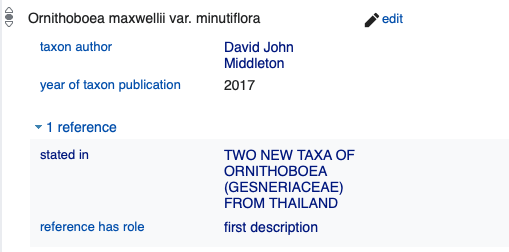

# Wikidata taxon name to publication mapping

This repository stores mappings between taxon names and publications in Wikidata. The goal is for every taxon [Q16521](https://www.wikidata.org/wiki/Q16521) in Wikidata to have the value for its taxon name [P225](https://www.wikidata.org/wiki/Property:P225) that is linked to at least one publication in Wikidata that acts as a reference for that name. Ideally the publication that first established the taxon name would be one of those publications, for example:

With these links anyone using Wikidata to find out about a taxon would be pointed to the primary taxonomic literature.

The approach adopted here is to provide the mapping in the form of tab-delimited files (TSV), together with scripts to generate the Quickstatements required to populate Wikidata. Having the data in human-readable form in a separate, citable repository provides provenance (and blame) for the mapping. The actual mappings are created elsewhere, often in databases that have additional information that is not directly relevant to the goals of this repository, or where reproducing the complete dataset may have licensing issues. The subset here is essentially a between two existing Wikidata values, and is released as CC0.

## Structure of the data

The mapping is stored as a TSV file with terms based on [Darwin Core](https://dwc.tdwg.org/terms/) and [GBIF Literature References](http://rs.gbif.org/terms/1.0/Reference).

Field | Description
--|--
scientificName | Scientific name of the taxon, corresponds to [Wikidata property P225](https://www.wikidata.org/wiki/Property:P225)
scientificNameID | Identifier of the name in source database as a [CURIE](https://en.wikipedia.org/wiki/CURIE), e.g. ipni:77070256-1 for record [77070256-1](https://ipni.org/n/77070256-1) in IPNI.
taxonID | Wikidata QID for the taxon
namePublishedInID | Wikidata QID for the publication
referenceType | Term to describe the role the reference plays, drawn from  (Reference Type GBIF Vocabulary)[http://rs.gbif.org/vocabulary/gbif/reference_type.xml], for example “original”, “combination”. If the role is not known this field is empty. 
modified | Unix timestamp for last time this record was modified (can use this as a filter to only add most recent records).

The data file is stored sorted by `scientificName` which makes it easy to browse and also should make it easier to display diffs between versions.

### Roles for references

The role a reference plays can be expressed using the [P6184](https://www.wikidata.org/wiki/Property:P6184) qualifier. The table below lists a mapping between the values for `type` and Wikidata roles. The `gbif:` namespace is http://rs.gbif.org/vocabulary/gbif/referenceType/

Type | URI | Wikidata role | Notes
--|--|--|--
original | gbif:original | first description [Q1361864](https://www.wikidata.org/wiki/Q1361864) | Original (“first”) description of a taxon, the first time this name has been published. Use tis for “sp. nov.”, “gen. nov.”, etc.
combination | gbif:combination | recombination [Q14594740](https://www.wikidata.org/wiki/Q14594740) | A new combination, such as when a species is moved to another genus. Use this for “comb. nov.”, etc.

## Generating Quickstatements

The script `qs.php` reads the `wikidata.tsv` file and generates the quick statements needed to add the publications to the taxa in Wikidata.

